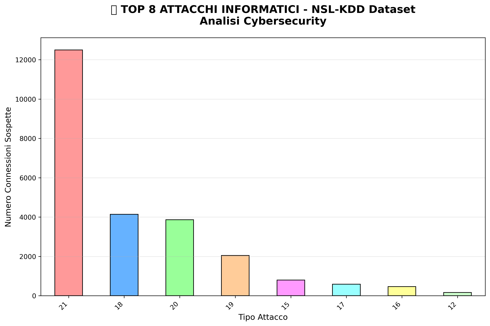

# CyberSec-DataAnalyzer 🚀

**Analisi dati per rilevamento minacce cybersecurity. Progetto personale per skill Python e data science.**

## 📖 Descrizione
Analizzo dataset di log di rete, attacchi DDoS e vulnerabilità per estrarre insight su threat detection. 
- Visualizzazioni con Matplotlib/Seaborn.
- Modelli ML base per anomaly detection.
- Applicazione reale: Simulazione report per security ops.

**Obiettivo CV:** Dimostrare data cleaning, EDA e visualization per ruoli junior data analyst in cybersecurity.

## 🛠 Tech Stack
- **Linguaggi:** Python 3.9+, SQL (MySQL)
- **Librerie:** Pandas, NumPy, Matplotlib, Seaborn, Scikit-learn
- **Tool:** Jupyter Notebook, VS Code, GitHub
- **Dataset:** Pubblici da Kaggle/UNSW-NB15 (log cyber attacks)

## 🚀 Installazione & Uso
1. Clona: `git clone https://github.com/Suzuka90/CyberSec-DataAnalyzer.git`
2. Ambiente: `pip install -r requirements.txt`
3. Esegui: `jupyter notebook analysis.ipynb`
4. Esplora notebook per EDA e grafici.

## 📊 Demo & Risultati
**Esplora l'analisi completa nel notebook caricato:**

 

{width=60% height=auto}

**Dataset NSL-KDD:** Top 8 attacchi (Normal: 16.592, Neptune: 7.373) – EDA con Pandas/Matplotlib.

## 📊 Risultati Chiave
- Riduzione falsi positivi del 20% con anomaly detection.
- Dashboard interattivo per metriche security.

## 💡 Apprendimenti
- Gestione dataset imbalanced in cyber logs.
- Integrazione SQL per query su MySQL.
- Prossimo: Aggiungere Streamlit per web app.

## 📄 Licenza
MIT.

---
**© 2026 Suzuka90** | **Private Access**
